# Firmware Document

## Example Code in main.cpp

```c++

#include "bms_can_utils.h"
#include "bms_udp_utils.h"
#include "bms_ltc6811_driver.h"
#include "bms_isl28022_driver.h"

void setup() {
    Serial.begin(115200);
    can::driver::setup();
    udp::driver::setup();
    ltc6811::driver::setup();
    isl28022::driver::setup();
}

void loop() {
    delay(1000);
    ltc6811::driver::loop();
    ltc6811::data::dbg(); // Serial Print Debug
    isl28022::driver::loop();
    isl28022::data::dbg(); // Serial Print Debug
    udp::driver::report(ltc6811::data::cell_data.sum, isl28022::data::current, ltc6811::data::cell_data, ltc6811::data::temp_data);
    can::driver::report(ltc6811::data::cell_data.sum, isl28022::data::current, ltc6811::data::cell_data, ltc6811::data::temp_data);
}
```

## Communication Protocol on CAN/UDP



## Various parameter adjustments 
### You should check these parameters before building the firmware.
```src/params.h```
| Variables         | Meaning                                          |
| ----------------- | ------------------------------------------------ |
| CAN_ID            | Board-specific CANID                             |
| CHANE_LENGTH      | Number of ltc6811s connected to the master board |
| CAN_BITRATE       | canbus bitrate                                   |
| HOST_IP_ADDRESS   | Destination address of UDP packets               |
| DEVICE_IP_ADDRESS | Board-specific IP address                        |
| GATEWAY_ADDRESS   | gateway address                                  |
| SUBNET_MASK       | subnet mask                                      |
| SSID              | wifi ssid                                        |
| PASSWORD          | wifi password                                    |

```src/bms_ltc6811_driver.h namespace ltc6811::param```

| Variables            | Meaning                                                            |
| -------------------- | ------------------------------------------------------------------ |
| DISCHARGE_PERMISSION | Discharge Permission Settings Dcp::Enable or Dcp::Disable          |
| DUTY_RATIO           | Discharge Transistor Drive Duty Ratio                              |
| TEMP_LIMIT           | PCB Temperature Limit (Discharge stops when the limit is exceeded) |
| VOL_DIF_TOL_LIMIT    | Allowable Voltage Difference When Discharge State is TOL_LINE      |
| VOL_DIF_TOL_LIMIT    | Allowable Voltage Difference When Discharge State is TOL_LINE      |
| VOL_DIF_ABS_LIMIT    | Allowable Voltage Difference When Discharge State is ABS_LINE      |
| BATTERY_THRMISTA_ID  | ltc6811 thrmista voltage register index for BATTERY temperature    |
| PCB_THRMISTA_ID      | ltc6811 thrmista voltage register index for PCB temperature        |

## CAN Driver ```src/bms_can_utils.h```

```c++
namespace driver {

/**
* @brief Initializes the CAN (Controller Area Network) communication.
* 
* This function sets the CAN pins, starts the CAN bus with a specified bitrate,
* sets up a filter for extended CAN messages, defines a callback function for
* received messages, and sets a timeout.
* 
* @return false if the initialization is successful, true if it fails.
*/
    bool setup() {}
/**
 * @brief Reports various BMS (Battery Management System) status data over CAN.
 * 
 * This function sends multiple CAN messages containing the voltage, current, cell voltage range,
 * throttle discharge status, and temperature data. If a request flag is set, it also sends detailed
 * cell voltage data.
 * 
 * @param voltage The voltage value to report.
 * @param current The current value to report.
 * @param cell_data The cell voltage data to report.
 * @param temp_data The temperature data to report.
 * @return true Always returns true after sending the data.
 */
    bool report(uint32_t voltage, uint32_t current, ltc6811::data::CellVoltage &cell_data, ltc6811::data::Temperature &temp_data)
};
```

## UDP Driver ```src/bms_udp_utils.h```
```c++
namespace driver {
/**
 * @brief Sets up the WiFi and UDP communication.
 * 
 * This function configures the WiFi with a static IP address, sets the WiFi mode to station,
 * connects to the specified WiFi network, and starts listening for UDP packets on port 12351.
 * When a UDP packet is received, the `response_cellvol` callback function is called.
 */
void setup() {}

/**
 * @brief Reports various BMS (Battery Management System) status data over UDP.
 * 
 * This function sends multiple UDP messages containing the voltage, current, cell voltage range,
 * throttle discharge status, and temperature data. If a request flag is set, it also sends detailed
 * cell voltage data.
 * 
 * @param voltage The voltage value to report.
 * @param current The current value to report.
 * @param cell_data The cell voltage data to report.
 * @param temp_data The temperature data to report.
 * @return true Always returns true after sending the data.
 */
bool report(uint32_t voltage, uint32_t current, ltc6811::data::CellVoltage &cell_data, ltc6811::data::Temperature &temp_data)
{}
}

```

## BMS(LTC6811) Driver ```src/bms_ltc6811_driver.h```


```c++
namespace data {
/**
 * @brief Prints debug information for the LTC6811 data.
 * 
 * This function outputs various temperature and voltage data, as well as discharge status and PWM ratios,
 * to the serial monitor for debugging purposes.
 */
void dbg() {}
}

namespace driver {
/**
 * @brief Sets up the SPI communication and initializes the LTC6811 driver.
 * 
 * This function initializes the SPI bus, sets the SPI settings, configures the necessary pins,
 * wakes up the LTC6811 device, and sets the duty ratio. If setting the duty ratio fails, it prints an error message.
 */
void setup() {}

/**
 * @brief Main loop function for the BMS (Battery Management System).
 * 
 * This function continuously checks if cell voltage, temperature, and status data are available.
 * If all data are available, it calls the discharge loop method with the `Method_Min` strategy. you can change discharge method from template parametor
 */
void loop() {}
}

```

## BMS(LTC6811) Discharge Method ```src/bms_ltc6811_driver.h``` namespace driver::discharge


```c++
/**
     * @brief Enum representing the discharge state.
     */
    enum class DeltaLine : uint8_t
    {
        TOL_LINE,  ///< Tolerance line state
        ABS_LINE,  ///< Absolute line state
    };
    /**
     * @brief Updates the voltage delta based on the current state.
     */
    void update_delta(){}

    /**
     * @brief Updates the state based on the configuration data.
     * 
     * @param data The configuration data.
     */
    void update_state(data::Config &data){}

    /**
     * @brief Method for updating discharge control configuration using minimum voltage.
     */
    struct Method_Min
    {
        /**
         * @brief Updates the discharge control configuration.
         * 
         * @return The updated configuration.
         */
        data::Config update_dcc(){}
    };

    /**
     * @brief Method for updating discharge control configuration using mean voltage.
     */
    struct Method_Mean
    {
        /**
         * @brief Updates the discharge control configuration.
         * 
         * @return The updated configuration.
         */
        data::Config update_dcc(){}
    };

    /**
     * @brief Main loop function for discharge control.
     * 
     * @tparam C The method class to use for updating the discharge control configuration.
     */
    template <class C>
    void loop() {}
```


## BMS(ISL28022) Driver ```src/bms_isl28022_driver.h```


