# Firmware Document

## Example Code in main.cpp

```c++

#include "bms_can_utils.h"
#include "bms_udp_utils.h"
#include "bms_ltc6811_driver.h"
#include "bms_isl28022_driver.h"

void setup() {
    can::driver::setup();
    udp::driver::setup();
    ltc6811::driver::setup();
    isl28022::driver::setup();
}

void loop() {
    delay(1000);
    ltc6811::driver::loop();
    ltc6811::data::dbg(); // Serial Print Debug
    isl28022::driver::loop();
    isl28022::data::dbg(); // Serial Print Debug
    udp::driver::report(ltc6811::data::cell_data.sum, isl28022::data::current, ltc6811::data::cell_data, ltc6811::data::temp_data);
    can::driver::report(ltc6811::data::cell_data.sum, isl28022::data::current, ltc6811::data::cell_data, ltc6811::data::temp_data);
}
```

## Communication Protocol on CAN/UDP



## Various parameter adjustments ```src/params.h```

| Variables         | Meaning                                          |
| ----------------- | ------------------------------------------------ |
| CAN_ID            | Board-specific CANID                             |
| CHANE_LENGTH      | Number of ltc6811s connected to the master board |
| CAN_BITRATE       | canbus bitrate                                   |
| HOST_IP_ADDRESS   | Destination address of UDP packets               |
| DEVICE_IP_ADDRESS | Board-specific IP address                        |
| GATEWAY_ADDRESS   | gateway address                                  |
| SUBNET_MASK       | subnet mask                                      |
| SSID              | wifi ssid                                        |
| PASSWORD          | wifi password                                    |

## CAN Driver ```src/bms_can_utils.h```

## UDP Driver ```src/bms_udp_utils.h```

## BMS(LTC6811) Driver ```src/bms_ltc6811_driver.h```

## BMS(ISL28022) Driver ```src/bms_isl28022_driver.h```


